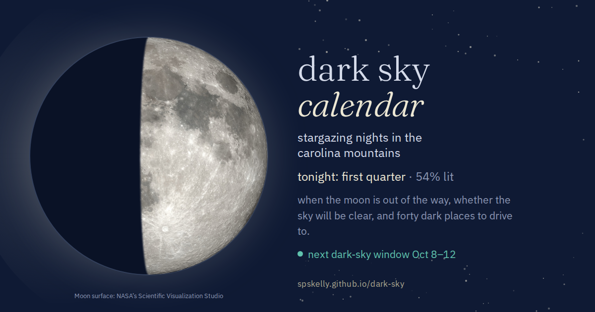

# dark sky calendar

A single-page planner for stargazing and astrophotography nights in the
North Carolina mountains: when the moon is out of the way, whether the sky
will be clear, and where to drive.

**[spskelly.github.io/dark-sky](https://spskelly.github.io/dark-sky/)**



## What it does

- **Moon phase calendar.** True phase times from the Meeus algorithm
  (*Astronomical Algorithms*, ch. 49), converted to your local time zone, so
  dates match published almanacs to the day. Phases are drawn at 9pm local —
  roughly when you'd be looking up — and the lit limb flips for the southern
  hemisphere.
- **Dark-sky windows.** A 3, 5 or 7 day band centred on each new moon,
  highlighted on the calendar and listed for the next twelve months, with the
  Friday and Saturday nights in each one called out and a note on where the
  Milky Way core sits that month.
- **Hourly sky forecast.** Cloud cover, temperature, wind and dew point for
  tonight, sunset to sunrise, from [Open-Meteo](https://open-meteo.com/)
  (no API key). Each night in the calendar also carries its mean 9pm–3am
  cloud cover.
- **40 dark-sky spots.** Overlooks, balds and campgrounds across western
  North Carolina, from the Cherohala Skyway to Doughton Park, on a topo map.
  Set a home point — a town from the list, a click on the map, or your own
  location — and everything reorders around it, ranked by estimated drive
  time or straight-line distance. Each spot links to its Clear Outside
  forecast, light-pollution map and driving directions.

  Drive time is estimated rather than routed: each spot carries the minutes
  of slow going once you are off the highway (gravel, the parkway detour,
  the walk in from the lot), and the rest scales with distance from wherever
  home is. That makes it a property of the spot rather than of any one town.

- **Light pollution and the parkway, on the map.** A sky-brightness overlay
  (the familiar green-to-red wash) sits behind the pins on a toggle, and the
  Blue Ridge Parkway is drawn as a line so the route the notes keep referring
  to is one you can actually see. Both are off the critical path: the overlay
  says so if its tiles stop loading, and the parkway is simply absent until
  `tools/build-parkway.mjs` has been run.

## Running it

The site is one `index.html` with no build step and no runtime dependencies.
Open it directly, or serve the directory:

```sh
python3 -m http.server 8000   # then open http://localhost:8000
```

The map (Leaflet, from cdnjs) and the forecast (Open-Meteo) need network
access; everything else — the phase maths, the calendar, the spot list —
works offline, and the map degrades to the list with a note.

## The moon is always current

Two things show tonight's real phase, and neither is hand-drawn.

- **The tab icon** is generated in the browser on every render, from the same
  `moonPath()` the calendar icons use, and follows the hemisphere toggle. The
  icon in `<head>` is only the no-script fallback.
- **`og.png`**, the link-preview image, is rebuilt daily by
  [a GitHub Action](.github/workflows/og-card.yml). It doesn't recompute
  anything: `tools/build-og.mjs` loads this very page in headless Chromium and
  calls the page's own `lunationFraction()`, `moonSvg()` and `phaseWord()`, so
  the card cannot drift from the calendar it advertises. It commits only when
  the image actually changes.

## The parkway line

`PARKWAY` in `index.html` is a simplified centreline, generated rather than
typed, and it ships empty. To fill it in (needs network, and only when the
route changes, which is close to never):

```sh
node tools/build-parkway.mjs             # rewrites the block in index.html
node tools/build-parkway.mjs --dry-run   # print the stats, change nothing
```

It asks OpenStreetMap, via Overpass, for the ways in the Blue Ridge Parkway
route relation, clips them to western North Carolina, simplifies each to about
120 metres and writes the result between the `parkway:start` and `parkway:end`
markers. The road travels in the page rather than being fetched at runtime, so
it still draws from `file://` and offline, and cannot break because somebody
else's API moved. With the block empty the map just doesn't draw it.

## The sky glow layer

The **light pollution** button on the map draws D. Lorenz's world atlas of
artificial night sky brightness over the topo. That is somebody else's static
tile set on GitHub Pages, and it is the one part of the page that can break on
its own: he republishes under a new folder every few years — `lp2016`, `lp2020`,
`lp2022` — and when the old folder goes, every tile comes back 404.

The page notices. After four misses with nothing loaded it switches the layer
off, greys the button out and says so, rather than leaving a live-looking
toggle that does nothing. Every spot still links to its own light map, which is
where the detail was anyway.

To point it at wherever the tiles live now (needs network):

```sh
node tools/find-lp-tiles.mjs           # search, report, change nothing
node tools/find-lp-tiles.mjs --fix     # ... and write the winner into index.html
```

It works from most certain to least. A GitHub Pages site is served straight
out of a public repo, so the first pass *reads* the file layout through the
contents API rather than guessing at it — one real tile filename is enough.
Failing that it reads the site's own pages, printing the small ones whole,
because a 300-byte page is a signpost rather than content; it follows meta
refreshes, frames and links, and turns any `getTileUrl` it finds into a
template. Only then does it try the shapes such tile sets usually take.

A filename says which numbers are in it, not which is z, which is x and which
is y, so the last step is always the same: put them in every way round and let
the network decide. Nothing is believed until it returns real images at three
zooms over two places far apart, which is what rules out x and y being right
the wrong way round. It also reports how deep the set goes, so `maxNativeZoom`
matches — get that wrong and the layer looks broken at exactly the zoom you'd
use to pick a spot.

If both passes come up empty, open the overlay in a browser, take one working
tile URL out of the network tab, and hand it over with the numbers replaced:

```sh
node tools/find-lp-tiles.mjs --url 'https://.../{z}/{x}/{y}.png' --fix
```

## Checking the pins

`tools/check-spots.mjs` measures the spot coordinates against two references
that are not somebody's memory:

```sh
node tools/check-spots.mjs           # report, change nothing
node tools/check-spots.mjs --snap    # put roadside pull-offs on the road
node tools/check-spots.mjs --osm     # compare every spot to OpenStreetMap
node tools/check-spots.mjs --osm --fix
```

Anything tagged with a milepost is, by definition, on the parkway, so once the
centreline is in the page an overlook sitting a mile off it is wrong by
construction — `--snap` moves those, and only those, onto the line. A summit or
a campground up a side road is left alone: its milepost is where you leave the
parkway, not where the spot is.

It also runs a check that needs no external data at all. Two points on one road
cannot be farther apart in a straight line than the difference in their
mileposts, so any pair that is proves one of them wrong. That is what vouches
for a snap: the spots already sitting on the road agree with each other, and
after a snap the moved ones agree with them too.

For everything away from the parkway there is no reference line, so `--osm`
compares each spot to the OpenStreetMap feature of the same name and reports the
distance. `--fix` applies only point features — never the centroid of a park the
size of a county, which is a spot in the woods rather than the parking.

The npm dependencies exist for that generator alone — the site itself ships
nothing from `node_modules`. To rebuild the card by hand:

```sh
npm ci && npx playwright install chromium && npm run build:og
```

## Check before you go

The spot list is one person's notes, not an official source. Coordinates are
approximate parking or summit points; elevations and drive times are rounded;
and the camping, fire and access notes were true when written and may not be
true tonight. Gates close for ice, forest orders change, permits appear, roads
wash out, campgrounds run seasonally.

Confirm anything you are relying on with whoever manages the land —
[parkway road closures](https://www.nps.gov/blri/planyourvisit/roadclosures.htm),
[Smokies road status](https://www.nps.gov/grsm/planyourvisit/temproadclose.htm),
[National Forests in NC](https://www.fs.usda.gov/r08/nfsnc),
[NC State Parks](https://www.ncparks.gov/) — and treat the forecast as a model
rather than a promise. These are remote places at four to six thousand feet,
often on gravel, usually with no signal.

## Notes

- The window is a planning heuristic. The moon also rises and sets, so a
  waxing crescent a few days past new is gone by late evening and a waning
  crescent doesn't rise until the small hours; those edge days are often
  darker than they look.
- Drive times assume the Blue Ridge Parkway is open. The high sections close
  for ice from November into April — check
  [NPS road status](https://www.nps.gov/blri/planyourvisit/roadclosures.htm)
  before committing to a gate.
- Tiles: [OpenTopoMap](https://opentopomap.org/) (CC-BY-SA) and USGS
  imagery via The National Map. The sky-brightness overlay is David Lorenz's
  [light pollution atlas](https://djlorenz.github.io/astronomy/lp2022/), built
  from the World Atlas and VIIRS; the parkway geometry is
  [OpenStreetMap](https://www.openstreetmap.org/copyright) (ODbL).
